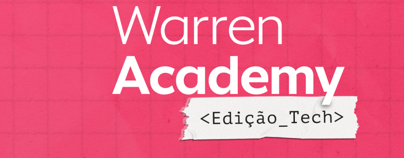
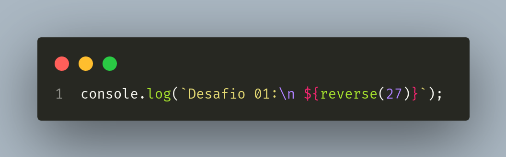
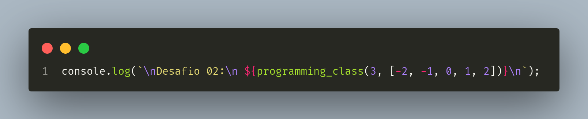
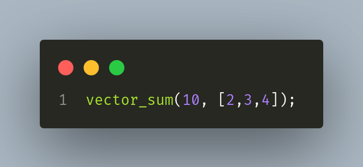

<p align="center">
  
</p>

<h1 align="center">Desafio de Programação - Warren Tech Academy</h1>
<p align="center">Resolvido por Wagner Moreira</p>

## Descrição

Solução do desafio de programação da Warren Tech Academy.

## Entregas

* [X] **Desafio 01:** Construa um algoritmo que mostre na tela todos os números n onde a soma de n + reverso(n) resultem em números ímpares que estão abaixo de 1 milhão.
<br>
* [X] **Desafio 02:** Construa um algoritmo que dado o tempo de chegada de cada aluno e o limite x de alunos presentes, determina se a classe vai ser cancelada ou não ("Aula cancelada” ou “Aula normal”).
<br>
* [X] **Desafio 03:** Dado um vetor de números e um número n. Determine a soma com o menor número de elementos entre os números do vetor mais próxima de n e também mostre os elementos que compõem a soma. Para criar a soma, utilize qualquer elemento do vetor uma ou mais vezes.

## Como utilizar

### Tecnologias necessárias

<div display='flex'>
  
  
  
  
  
</div>

### Clone o repositório

* Clone este repositório:

```bash
git@github.com:wagnermor/desafio-warren.git
```

Caso precise de ajuda para clonar o repositório, clique [aqui](https://docs.github.com/pt/github/creating-cloning-and-archiving-repositories/cloning-a-repository)

### Execute os testes

* Dentro do diretório clonado, execute o comando:
```bash
npm test
```

### Rodando os desafios

* Dentro do diretório clonado, execute o comando:
```bash
node warren-academy.js
```

### Alterando valores de entrada

* Para alterar os valores de entrada, edite os parâmetros das respectivas funções: reverse(number), programing_class(number, array) e vector_sum(number, array).
<div display='flex'>
  
  
  
</div>